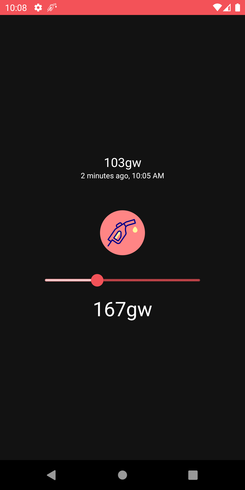
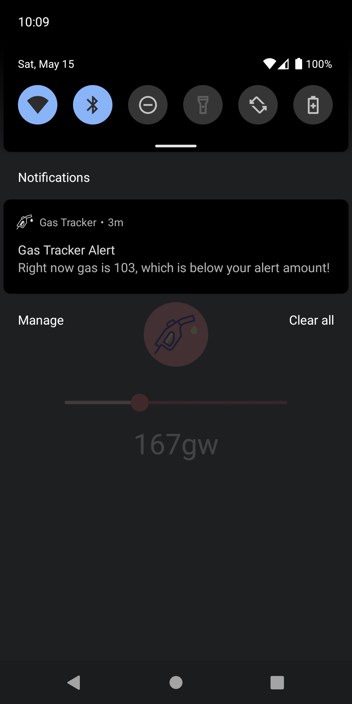
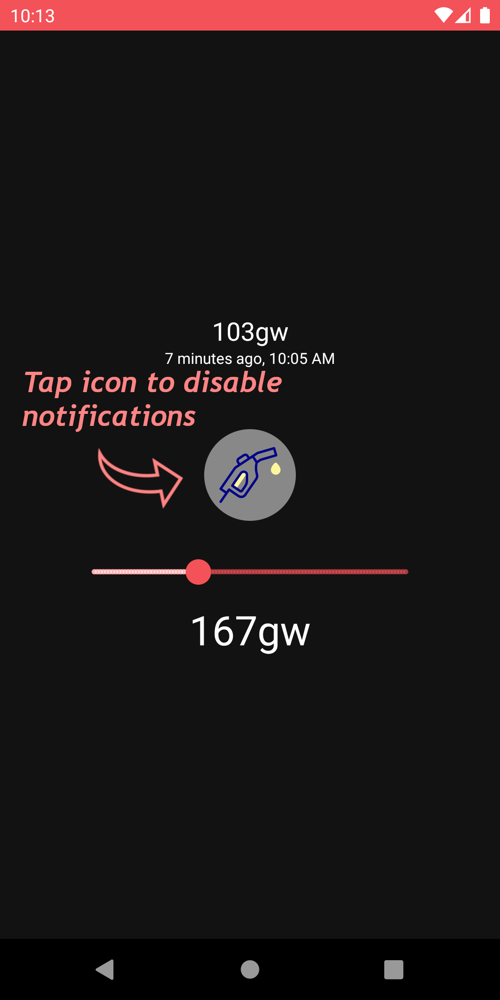

# Gas Tracker
*Stop refreshing gas tracking websites!*

*Get gas price alerts on your phone in the background!*

This is primarily a project to grok Compose UIs in Android, but also practical ad-free alternative to other apps for something I wanted on my phone. You can get it on the [Play Store](https://play.google.com/store/apps/details?id=com.github.hjubb.gastracker) or build it from source here :)

## How
Set a gas price threshold and receive a notification if the safe gas price is currently below it.

In the app: see the latest fetched price, enable or disable gas price alert notifications, set an alert price limit.

App polls in the background every 15 minutes and when opening the app and renders notification if notifications enabled and gas is less than target.

(you will have a notification that sticks around every 15 minutes unless gas goes above target or you disable notifying in the app)

## Screenshots
| | | |
--- | :---: | ---
 | | 

## Credits

Made using Jetpack Compose, DataStore, WorkManager, Kotlin, [Fuel](https://github.com/kittinunf/fuel) (Core, Kotlinx Serialization, Coroutines), [DefiPulse Data](https://docs.defipulse.com/api-docs-by-provider/egs/gas-price#gas-price)

Icons made by [Freepik](https://www.freepik.com) from [www.flaticon.com](https://www.flaticon.com/)